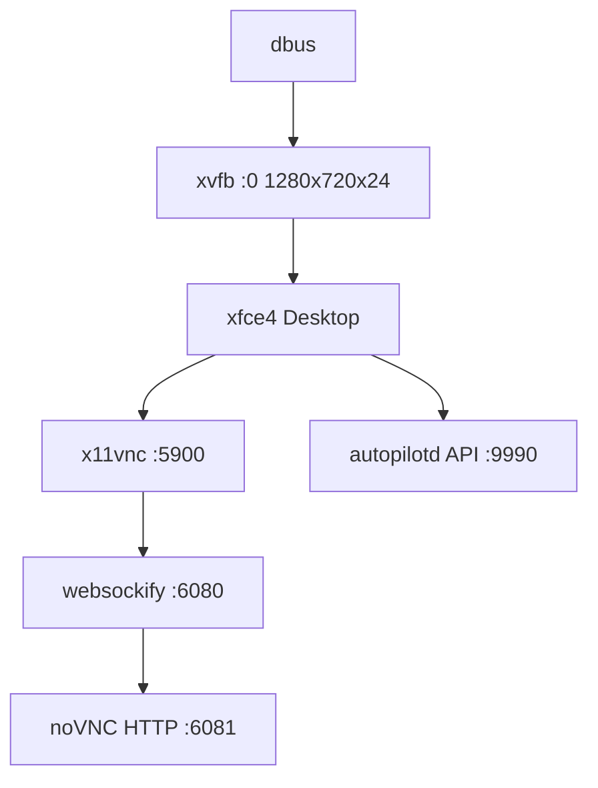

# Docker Autopilot

A Docker container providing a virtual desktop environment (Ubuntu 22.04 with XFCE4) designed for computer use agents. Exposes a REST API for programmatic control of mouse, keyboard, screen capture, OCR, and desktop interactions.

## Features

- **Virtual Desktop Environment**: Full XFCE4 desktop with Firefox ESR pre-configured
- **Remote Access**: VNC and noVNC web client for visual monitoring
- **REST API**: Comprehensive API for desktop automation (`autopilotd`)
- **OCR Support**: Text detection and localization using EasyOCR
- **Multi-Instance Ready**: Run multiple isolated desktop environments simultaneously
- **Headless Operation**: Runs on Xvfb virtual framebuffer

## Architecture

The container orchestrates multiple services via supervisord:



### Service Stack

| Service | Port | Priority | Description |
|---------|------|----------|-------------|
| dbus | - | 1 | System message bus |
| xvfb | - | 10 | Virtual framebuffer X server |
| xfce4 | - | 20 | Desktop environment |
| x11vnc | 5900 | 30 | VNC server |
| websockify | 6080 | 40 | WebSocket proxy for noVNC |
| novnc-http | 6081 | 50 | HTTP server for noVNC client |
| autopilotd | 9990 | 60 | FastAPI automation service |

## Quick Start

### Build the Image

```bash
./build.sh
```

Or manually:

```bash
docker build -t docker-autopilot .
```

### Run a Single Instance

```bash
docker run --privileged -d \
  -p 9990:9990 \
  -p 5900:5900 \
  -p 6080:6080 \
  -p 6081:6081 \
  --name docker-autopilot \
  docker-autopilot
```

**Note**: The `--privileged` flag is required for full desktop functionality.

### Run Multiple Instances

**Using docker-compose (3 instances):**

```bash
./composer.sh
```

This creates:
- `autopilot-1`: ports 9990, 6080, 6081
- `autopilot-2`: ports 9991, 6082, 6083
- `autopilot-3`: ports 9992, 6084, 6085

**Using run.sh (5 instances):**

```bash
./run.sh
```

Creates 5 instances on ports 9990-9994 (API) and 6080-6089 (noVNC/HTTP).

## Accessing the Environment

Once running, access the container via:

- **API Endpoint**: `http://localhost:9990/computer-use`
- **noVNC Web Client**: `http://localhost:6080/vnc.html`
- **VNC Direct**: `localhost:5900` (use any VNC client)

## API Reference

The `/computer-use` endpoint accepts POST requests with JSON payloads specifying an `action` and relevant parameters.

### Mouse Actions

**Move Mouse (xdotool)**
```bash
curl -X POST http://localhost:9990/computer-use \
  -H "Content-Type: application/json" \
  -d '{"action": "move_mouse", "coordinates": {"x": 100, "y": 200}}'
```

**Move Mouse (pyautogui with duration)**
```bash
curl -X POST http://localhost:9990/computer-use \
  -H "Content-Type: application/json" \
  -d '{"action": "mouse_move", "coordinates": {"x": 100, "y": 200}, "delay": 1000}'
```

**Click Mouse**
```bash
curl -X POST http://localhost:9990/computer-use \
  -H "Content-Type: application/json" \
  -d '{"action": "click_mouse", "button": "1", "numClicks": 1}'
```

**Drag Mouse**
```bash
curl -X POST http://localhost:9990/computer-use \
  -H "Content-Type: application/json" \
  -d '{
    "action": "drag_mouse",
    "path": [{"x": 100, "y": 100}, {"x": 200, "y": 200}],
    "button": "left"
  }'
```

**Get Cursor Position**
```bash
curl -X POST http://localhost:9990/computer-use \
  -H "Content-Type: application/json" \
  -d '{"action": "cursor_position"}'
```

### Keyboard Actions

**Type Text**
```bash
curl -X POST http://localhost:9990/computer-use \
  -H "Content-Type: application/json" \
  -d '{"action": "type_text", "text": "Hello World", "delay": 30}'
```

**Press Keys**
```bash
curl -X POST http://localhost:9990/computer-use \
  -H "Content-Type: application/json" \
  -d '{"action": "press_keys", "keys": ["enter"]}'
```

**Hotkey Combination**
```bash
curl -X POST http://localhost:9990/computer-use \
  -H "Content-Type: application/json" \
  -d '{"action": "hotkey", "keys": ["ctrl", "c"]}'
```

### Screen Actions

**Take Screenshot**
```bash
curl -X POST http://localhost:9990/computer-use \
  -H "Content-Type: application/json" \
  -d '{"action": "screenshot"}'
```

Returns base64-encoded PNG image.

**Locate Text (OCR)**
```bash
curl -X POST http://localhost:9990/computer-use \
  -H "Content-Type: application/json" \
  -d '{
    "action": "locate_text",
    "text_to_find": "Submit",
    "confidence": 0.7
  }'
```

Returns bounding boxes with coordinates, dimensions, confidence, and detected text.

**Scroll**
```bash
curl -X POST http://localhost:9990/computer-use \
  -H "Content-Type: application/json" \
  -d '{"action": "scroll", "direction": "down", "amount": 100}'
```

### System Actions

**Execute Shell Command**
```bash
curl -X POST http://localhost:9990/computer-use \
  -H "Content-Type: application/json" \
  -d '{"action": "execute_command", "command": "ls -la"}'
```

Returns stdout, stderr, and return code.

**Get Clipboard Content**
```bash
curl -X POST http://localhost:9990/computer-use \
  -H "Content-Type: application/json" \
  -d '{"action": "clipboard"}'
```

**Make HTTP Request**
```bash
curl -X POST http://localhost:9990/computer-use \
  -H "Content-Type: application/json" \
  -d '{
    "action": "call_api",
    "url": "https://api.example.com/data",
    "method": "GET",
    "headers": {"Authorization": "Bearer token"}
  }'
```

**Upload Files**
```bash
curl -X POST http://localhost:9990/computer-use \
  -H "Content-Type: application/json" \
  -d '{
    "action": "upload_files",
    "files": [
      {"path": "/tmp/test.txt", "content": "Hello World"}
    ]
  }'
```

## Configuration

### Environment Variables

- `DISPLAY`: X11 display (default: `:0`)

Set via docker-compose:

```yaml
environment:
  - DISPLAY=:0
```

### Display Resolution

Modify in `supervisord.conf`:

```ini
[program:xvfb]
command=Xvfb :0 -screen 0 1280x720x24 -ac -nolisten tcp
```

### Firefox Configuration

Firefox ESR is pre-configured with policies in `/etc/firefox/policies/policies.json`:

- Password manager disabled
- No onboarding prompts
- Minimal UI distractions
- PDF.js enabled

### User Setup

- **User**: `autopilot` (non-root with sudo NOPASSWD)
- **Home**: `/home/autopilot`
- **Autologin**: Configured via lightdm
- **Poetry**: Installed for Python package management

## Project Structure

```
.
├── Dockerfile              # Multi-stage container build
├── docker-compose.yml      # Multi-instance orchestration
├── supervisord.conf        # Service management configuration
├── build.sh                # Build script with architecture detection
├── run.sh                  # Run 5 instances
├── composer.sh             # Run docker-compose
├── command.sh              # API testing examples
├── packages/
│   └── autopilotd/
│       ├── main.py         # FastAPI application
│       └── requirements.txt
├── xfce4/                  # Desktop environment customization
└── static/
    └── background.jpg      # Desktop wallpaper
```

## Development

### Python Dependencies

Key packages (see `packages/autopilotd/requirements.txt`):

- `fastapi`, `uvicorn` - Web framework
- `pyautogui` - GUI automation
- `opencv-python`, `easyocr` - OCR and image processing
- `pyperclip` - Clipboard access
- `requests` - HTTP client

### Adding New Actions

Edit `packages/autopilotd/main.py` and add a new action handler in the `/computer-use` endpoint:

```python
elif request.action == 'your_action':
    # Your implementation
    return {'status': 'success', 'data': result}
```

### Debugging

View logs from all services:

```bash
docker logs -f docker-autopilot
```

Access the desktop visually via noVNC to debug automation issues.

## Security Considerations

⚠️ **Important Security Notes**:

- Container requires `--privileged` flag for full desktop access
- Shell command execution enabled via `execute_command` action
- File upload capability allows writing to container filesystem
- No authentication on API endpoints
- Intended for isolated/trusted environments only

**Recommendations**:
- Run in isolated networks
- Add authentication middleware if exposing publicly
- Restrict file upload paths
- Validate and sanitize all command inputs

## Troubleshooting

### Container won't start

Check if ports are already in use:

```bash
lsof -i :9990
```

### Desktop not visible in noVNC

Ensure xvfb and xfce4 services started successfully:

```bash
docker exec docker-autopilot supervisorctl status
```

### OCR not working

EasyOCR downloads models on first use. Check logs:

```bash
docker logs docker-autopilot | grep easyocr
```

### Permission errors

Ensure the autopilot user has proper permissions:

```bash
docker exec -u autopilot docker-autopilot whoami
```

## License

This project is provided as-is for automation and testing purposes.

## Contributing

Contributions welcome! Please ensure:

- Code follows existing patterns
- API changes are documented
- Security implications are considered
